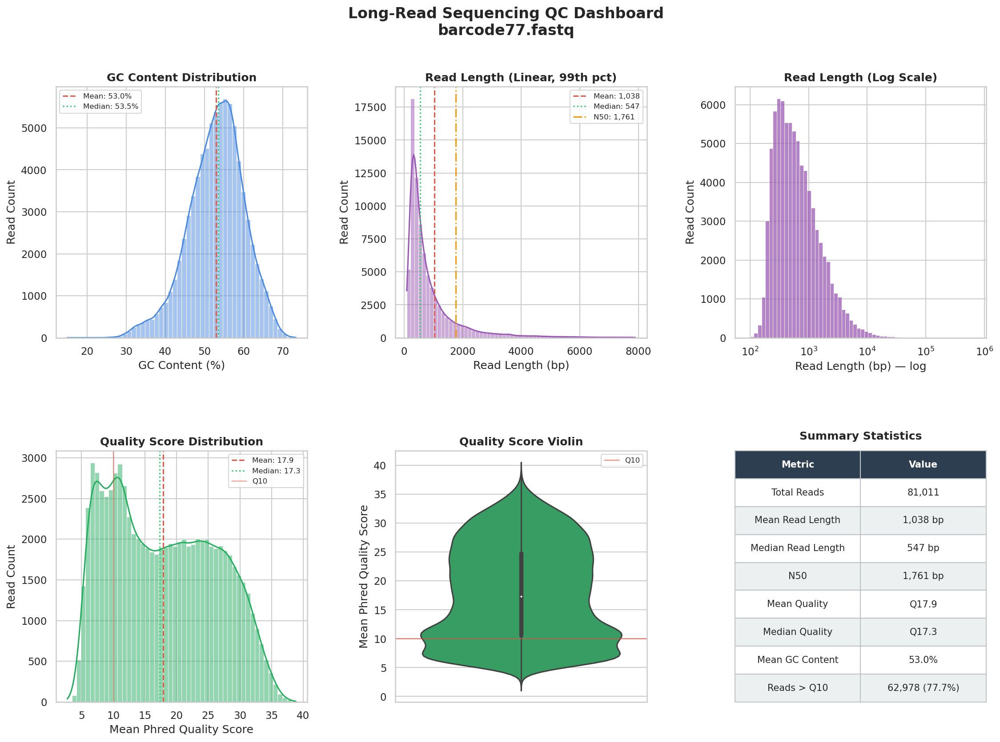

# 🧬 Mini Bioinformatics Pipeline

A reproducible long-read sequencing QC pipeline built with **Nextflow (DSL2)** and **Conda**.

## Project Structure
cat > README.md << 'EOF'
# 🧬 Mini Bioinformatics Pipeline

A reproducible long-read sequencing QC pipeline built with **Nextflow (DSL2)** and **Conda**.

## Project Structure
```
mini-bio-pipeline/
├── pipeline/main.nf        # Nextflow DSL2 pipeline
├── scripts/
│   ├── read_stats.py       # Per-read GC, length, quality stats
│   ├── visualize.py        # Distribution plots + summary statistics
│   └── dashboard.py        # QC summary dashboard
├── environment.yml         # Conda environment
├── Dockerfile              # Docker container definition
├── nextflow.config         # Pipeline configuration
├── example_output/         # Sample results and plots
│   ├── plots/              # All generated plots including dashboard
│   └── summary_stats.txt   # Printed summary statistics
└── email_to_professor.md   # Full report for Professor Kılıç
```

## Why These Plot Types?

| Metric | Plot Type | Reason |
|--------|-----------|--------|
| GC Content | Histogram + KDE | Shows distribution shape, easy to spot contamination |
| Read Length | Histogram (linear + log) | Linear shows bulk, log reveals full range including ultra-long reads |
| Quality Score | Histogram + Violin | Histogram shows distribution, violin reveals bimodal patterns |

## Quick Start

### Option A — Conda (Recommended)
```bash
git clone https://github.com/emrekeskin07/mini-bio-pipeline.git
cd mini-bio-pipeline
conda env create -f environment.yml
conda activate mini-bio-pipeline
nextflow run pipeline/main.nf -with-conda \
  --fastq "$PWD/data/barcode77.fastq" \
  --outdir "$PWD/results" \
  --scripts "$PWD/scripts"
```

### Option B — Docker
```bash
docker build -t mini-bio-pipeline .
docker run -v "$PWD/data:/pipeline/data" \
           -v "$PWD/results:/pipeline/results" \
           mini-bio-pipeline \
           nextflow run pipeline/main.nf \
           --fastq /pipeline/data/barcode77.fastq \
           --outdir /pipeline/results \
           --scripts /pipeline/scripts
```

### Generate Dashboard (Optional)
```bash
python scripts/dashboard.py \
  --input results/read_stats.csv \
  --outdir results/plots/
```

## Outputs

| File | Description |
|------|-------------|
| `results/read_stats.csv` | Per-read statistics (length, GC%, quality) |
| `results/nanostat_report/` | NanoStat QC summary |
| `results/plots/gc_content_distribution.png` | GC content histogram |
| `results/plots/read_length_distribution.png` | Read length histogram |
| `results/plots/quality_score_distribution.png` | Quality score distribution |
| `results/plots/dashboard.png` | Combined QC dashboard |

## Example Output

Sample results from `barcode77.fastq` are in `example_output/`.



## Key Findings (barcode77.fastq)

| Metric | Value | Interpretation |
|--------|-------|----------------|
| Total Reads | 81,011 | Good dataset size |
| Median Read Length | 547 bp | Expected for Nanopore |
| N50 | 1,761 bp | Sufficient for alignment |
| Median Quality | Q17.3 | Above Q10 threshold ✅ |
| Reads > Q10 | 77.7% | Good quality rate ✅ |
| Mean GC Content | 53.0% | Normal, no contamination ✅ |

**Conclusion:** Data quality is sufficient to proceed with alignment using Minimap2.

## Communication

See [`email_to_professor.md`](email_to_professor.md) for the full report addressed to Professor Kılıç.

**Summary:** 81,011 reads were analysed. Median quality Q17.3 with 77.7% of reads above Q10 threshold. GC content is clean at 53%. Read lengths are within expected Nanopore range. **Recommendation: proceed to alignment with Minimap2.**
